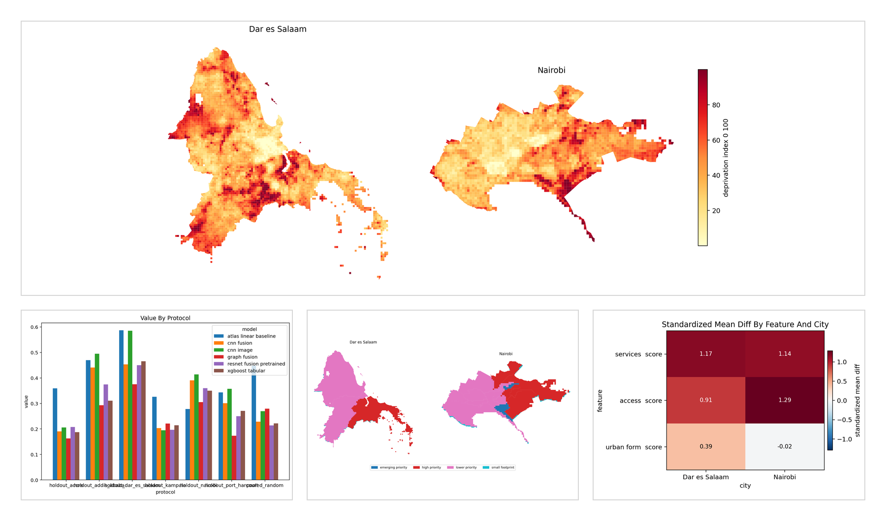
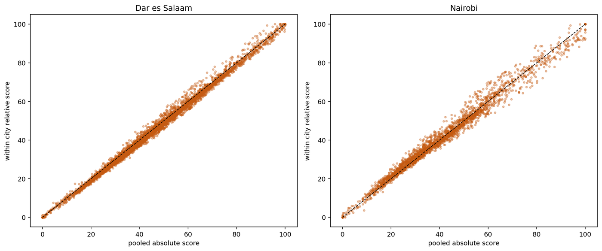
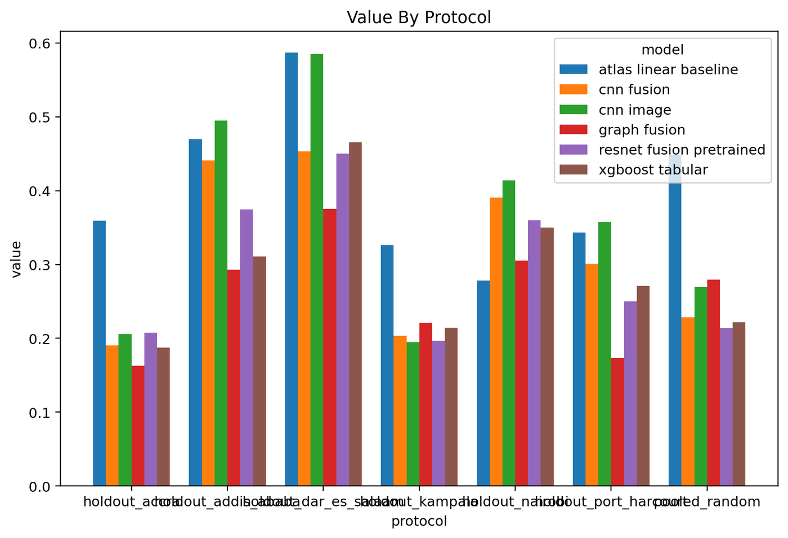

<h1 align="center">SSA Urban Deprivation Benchmark</h1>

<p align="center">
  Open multimodal benchmark for intra-urban deprivation measurement in sub-Saharan Africa.
</p>

<p align="center">
  
  
  
  
  
</p>

<p align="center">
  <a href="#at-a-glance">At a Glance</a> ·
  <a href="#methods">Methods</a> ·
  <a href="#current-results">Results</a> ·
  <a href="#reproducibility">Reproducibility</a> ·
  <a href="#license">License</a>
</p>

This repository is an open research pipeline for measuring and modeling intra-urban deprivation in sub-Saharan Africa. It combines an interpretable atlas baseline with a multicity multimodal benchmark built from public spatial data and weak external supervision.

The current repository has two empirical layers:

- a two-city atlas baseline for Nairobi and Dar es Salaam
- a six-city multimodal benchmark for Nairobi, Dar es Salaam, Kampala, Accra, Port Harcourt, and Addis Ababa

<p align="center">
  
</p>

<p align="center">
  <sub>Atlas baseline, six-city benchmark, district prioritization, and hotspot mechanism outputs.</sub>
</p>

## At a Glance

| Component | Specification |
| --- | --- |
| Study region | Six sub-Saharan African cities |
| Unit of analysis | 500 m urban grid cells |
| Benchmark sample | 11,895 labeled cells |
| Weak supervision | Relative Wealth Index |
| Model families | atlas baseline, XGBoost, CNN, multimodal fusion, pretrained ResNet fusion, graph fusion |
| External validation | GHSL built surface and VIIRS night-time lights |

## Highlights

- Public-data pipeline spanning atlas construction, multimodal prediction, and external validation.
- Interpretable baseline retained alongside transfer-oriented ML benchmarks rather than replaced by them.
- Configuration-driven workflow with CLI and Makefile entry points for reproducible reruns.
- Current benchmark scale: `11,895` labeled cells across six cities.

## Study Scope

- Primary unit of analysis: grid cells clipped to the urban study footprint
- Baseline atlas resolution: 500 m, with 1 km sensitivity analysis
- Multicity benchmark resolution: 500 m
- External weak target: Relative Wealth Index
- Current six-city benchmark size: 11,895 labeled cells

## Research Questions

1. How effectively can public multimodal urban data recover external weak deprivation signals across SSA cities?
2. Which model classes retain performance under leave-one-city-out transfer?
3. How do interpretable deprivation dimensions relate to hotspot structure and district-level concentration?

## Data Sources

The core pipeline uses public data only.

| Source | Asset used in current build | Role | Official link |
| --- | --- | --- | --- |
| geoBoundaries | ADM2 boundaries for KEN, TZA, UGA, GHA, NGA, ETH | reporting and district aggregation | https://www.geoboundaries.org/api.html |
| WorldPop | 2020 population rasters | population, exposure, service-burden features | https://hub.worldpop.org/ |
| ESA WorldCover | 2021 v200 tiles | land cover, built-up and open-space context | https://esa-worldcover.org/en/data-access |
| OpenStreetMap | local extracts recorded in manifest files | roads, intersections, schools, clinics, amenities | https://download.geofabrik.de/africa.html |
| Relative Wealth Index | country CSVs from HDX | weak external supervision target | https://data.humdata.org/dataset/relative-wealth-index |
| GHSL Built Surface | 2020 R2023A global raster | external validation of built-form features | https://ghsl.jrc.ec.europa.eu/download.php |
| VIIRS VNL | annual 2020 v2.1 raster | external validation against night-time light intensity | https://eogdata.mines.edu/products/vnl/ |

Exact source URLs used in local runs are recorded in the download manifests under `outputs/tables/`, including `mvp_download_manifest.json`, `core4_download_manifest.json`, `core6_download_manifest.json`, and the corresponding RWI download manifests.

## Methods

### Feature Construction

The feature pipeline derives grid-level measures from public raster and vector layers, including:

- road, school, and clinic distance
- amenity and service counts within a local buffer
- population per service proxy
- building coverage and open-space share
- intersection density

### Interpretable Baseline

The baseline deprivation index is a standardized composite measure with interpretable dimensions:

- `access`
- `services`
- `urban_form`
- `economic_proxy`

The index supports winsorization, pooled and within-city scaling, and 0-100 reporting.

### Spatial Interpretation

The atlas layer provides:

- PCA alignment checks
- Local Moran's I hotspot detection
- dominant-dimension annotation
- absolute versus within-city relative ranking comparison
- hotspot typologies
- ADM2 aggregation

### Multimodal Benchmark

The benchmark uses grid-aligned weak supervision from the Relative Wealth Index and compares:

- `atlas_linear_baseline`
- `xgboost_tabular`
- `cnn_image`
- `cnn_fusion`
- `resnet_fusion_pretrained`
- `graph_fusion`

Patch inputs are built from WorldPop, ESA WorldCover, rasterized road networks, and rasterized service layers.

### External Validation

The repository includes a generic raster-validation route and current validation outputs against:

- GHSL built surface
- VIIRS annual night-time lights

## Current Results

### Two-City Atlas

- Dar es Salaam has the higher mean deprivation score at 500 m: `45.77` versus `42.05` in Nairobi.
- Population share in the city-wide top decile is also higher in Dar es Salaam: `13.19%` versus `10.16%`.
- Hotspot burden is dominated by the `services` dimension in both cities.
- The principal district priorities are Temeke in Dar es Salaam and Embakasi Central in Nairobi.
- Cross-city ordering is unchanged under the 1 km sensitivity analysis.

<p align="center">
  
</p>

### Six-City Benchmark

- In pooled random evaluation, `resnet_fusion_pretrained` has the best overall performance:
  - RMSE `0.2137`
  - MAE `0.1669`
  - Spearman `0.8272`
  - ROC AUC `0.9488`
  - Average precision `0.8835`
  - Balanced accuracy `0.8887`
- Under leave-one-city-out evaluation, `graph_fusion` is the dominant model on most holdout protocols and metrics.
- The interpretable atlas baseline remains competitive: on `holdout_nairobi`, it has the lowest RMSE and MAE.

<p align="center">
  
</p>

### External Validation

- `building_coverage_ratio` aligns strongly with GHSL built surface across cities; the highest city-level alignment is in Dar es Salaam with Spearman `0.9054`.
- `urban_form__score` also shows strong positive alignment with GHSL built surface in most cities.
- The final deprivation index does not collapse to built intensity; alignment with GHSL is weak or negative in some cities.
- VIIRS night-time lights show the expected negative association with deprivation.
- The highest VIIRS alignment is for `rwi_deprivation_proxy_0_100` in Dar es Salaam with signed Spearman `0.7665`; the highest atlas-index alignment is in Addis Ababa with signed Spearman `0.6829`.
- The weakest VIIRS alignment is for `deprivation_index_0_100` in Nairobi.

## Key Outputs

- Core atlas findings: `outputs/tables/mvp_core_findings.json`
- Six-city benchmark summary: `outputs/tables/ml/core6_rwi_benchmark_summary.json`
- Six-city benchmark findings: `outputs/tables/ml/core6_rwi_benchmark_findings.json`
- GHSL validation findings: `outputs/tables/core6_ghsl_built_validation_findings.json`
- VIIRS validation findings: `outputs/tables/core6_viirs_validation_findings.json`
- Publication figure set: `outputs/figures/paper_core/`

## Repository Structure

```text
ssa-urban-deprivation-benchmark/
├── configs/
│   ├── studies/
│   ├── methods/
│   ├── results/
│   └── figure_sets/
├── data/
│   ├── raw/
│   └── processed/
├── metadata/
│   └── data_sources.yaml
├── outputs/
│   ├── tables/
│   └── figures/
├── src/ssa_urban_deprivation_benchmark/
├── tests/
├── environment.yml
├── pyproject.toml
└── Makefile
```

## Reproducibility

The repository is configured for the `pytorch` conda environment.

Update the environment:

```bash
conda env update -n pytorch -f environment.yml --prune
conda activate pytorch
```

Run the test suite:

```bash
conda run -n pytorch python -m pytest -q
```

Run the two-city atlas pipeline:

```bash
conda run -n pytorch make full-project
```

Run the six-city multimodal benchmark:

```bash
conda run -n pytorch make ml-core6
```

Run external validation:

```bash
conda run -n pytorch make validate-core6-ghsl-built
conda run -n pytorch make validate-core6-viirs VIIRS_RASTER=/path/to/validation_raster.tif
```

## Limitations

- OpenStreetMap completeness varies across cities and feature classes.
- Relative Wealth Index is used as weak supervision rather than as direct neighborhood ground truth.
- The current benchmark emphasizes predictive transfer and convergent validation, not causal identification.
- Source incompleteness is not yet propagated into a formal uncertainty model.

## License

The code in this repository is released under the MIT License. See [LICENSE](LICENSE).

Upstream datasets are not relicensed by this repository. Data use remains governed by the original source terms listed in `metadata/data_sources.yaml` and the corresponding provider portals.
